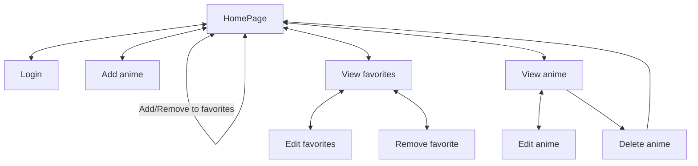

# Objectifs : 
Implémentez une application permettant de lister des animes, les ajouter en favoris et suivre où on en est dans les épisodes. Voici les fonctionnalités attendues: 
 - Lister des animes
 - Ajouter, Modifier, Supprimer des animes
 - Ajouter des animes en tant que Favoris
 - Spécifier un numéro d'anime à un favori correspondant au dernier episode vu par l'utilisateur. 

## Base de départ


Vous disposez:
 - `data/`: Un dossier contenant des fichiers CSV alimentant une base de données de départ (Source: Kaggle). 
 - `public/`: Un dossier squelette pour une éventuelle architecture de départ.


## Consignes /Livraison


### Exercice 1
Dans un premier temps, il est attendu de réaliser un script permettant d'alimenter une base de données MySQL avec les données issues des fichiers CSV. 
Vous disposez d'un premier fichier `inc/connectDB.php`. Vous pouvez aussi utiliser le Singleton suivant : 

```php
<?php
class DatabaseSingleton{
        private static $instance = null;
        private $conn;
        
        private function __construct()
        {
          // FIXME : Move these credentials to a .env file

          $host= '127.0.0.1';
          $port=3306;
          $dbname = 'festival';
          $user = 'demo_user';
          $password = 'demo_user';
          try {
           $this->conn = new PDO(
               "mysql:host=$host:$port;dbname=$dbname",
               $user,
               $password,      
                array(PDO::MYSQL_ATTR_INIT_COMMAND => "SET NAMES 'utf8'"));      
          } catch (PDOException $e) {
            error_log('Error whilst connecting to database. ');
            throw $e;
          }
        }
        
        public static function getInstance()
        {
          if(!self::$instance)
          {
            self::$instance = new DatabaseSingleton();
          }
         
          return self::$instance;
        }
        
        // TODO : Implement the functionnality with a prepared statement instead of a direct query
        public function query(string $query): array
        {
          $results = $this->conn->query($query);
          return $results->fetchAll( PDO::FETCH_COLUMN);
        }
      
}
```
Ecrivez le script `migrate.php` permettant de charger les fichiers issus de data au sein d'une base de données.

Vous pourrez executer ce script en le lancant en ligne de commande via : 
```sh
php migrate.php
```


### Exercice 2
Suite à celà, réalisez les pages suivantes : 



Ce qui mènera aux pages suivantes : 
- index.php : La Homepage , permettant de visualiser l'ensemble des animes existants au sein de la base de données
- login.php : Connexion utilisateur
- animes/create.php : Enregistrer un nouvel anime
- animes/show.php?id={id} : Visualiser un anime
- animes/edit.php?id={id} : Modifier un anime
- animes/delete.php?id={id} : Supprimer un anime
- favorites/index.php : Liste des favoris

#### Contraintes 
 - Ce projet peut être réalisé seul ou en binôme
 - Ce projet devra être livré via un dépôt git
 - Il est attendu de réaliser une maquette au préalable (Figma ?)
 - Votre site devra être responsive
 - Attention aux nommages de variables et des méthodes. 
 - Attention aux nommages des routes, elles doivent être cohérentes
 - Attention à avoir une décomposition des composants cohérente
 - Il ne doit y avoir aucun console.log ou code commenté futile

Une attention toute particulière est attendue pour le graphisme de votre site ainsi que de la mise en valeur des informations. N'hésitez par à utiliser des assets ou encore des frameworks CSS tels que bootstrap ou tailwind.

### Installation de ce projet
Clonez ce dépot.
Vous pouvez ajouter le dossier public de ce projet à un serveur web local (aka VirtualHost)
ou par le biais d'un terminal, allez dans le dossier public, puis: 
```sh
# In the folder of the cloned repository, probably nammed php-anime-tracker/public
php -S localhost:
```